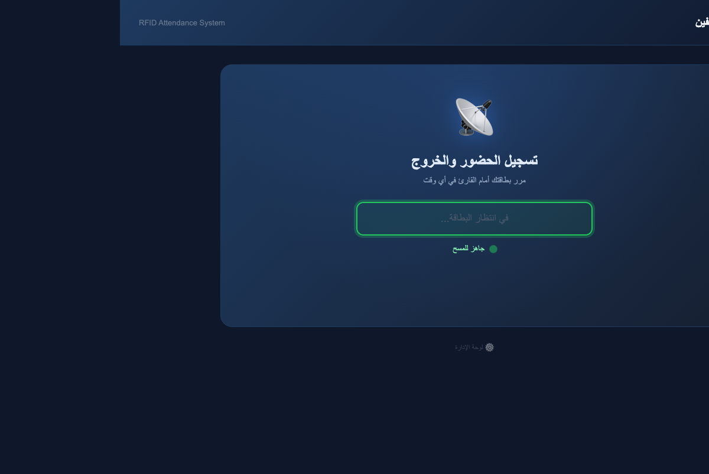
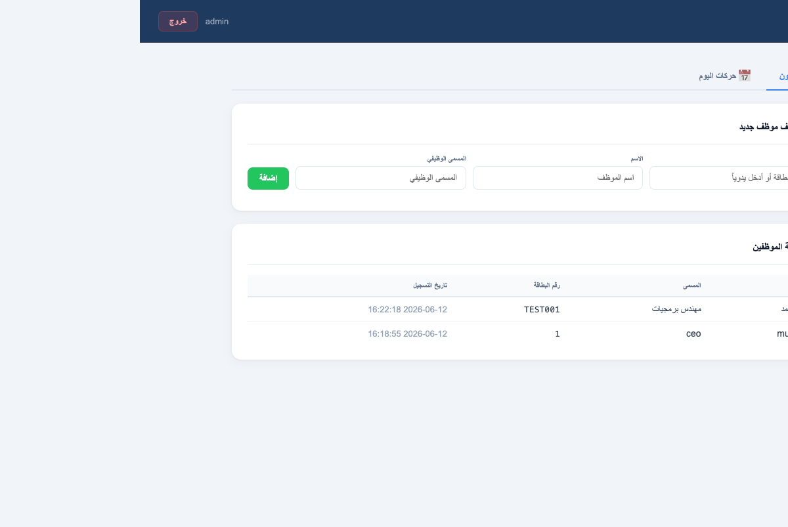

# RFID Attendance

مشروع حضور موظفين محلي بسيط — قارئ RFID USB + واجهة ويب.

## Screenshots

### شاشة المسح (Kiosk)


### لوحة الإدارة (Admin Panel)


## التشغيل

```bash
npm install
npm start
```

افتح:

```
http://localhost:3000        ← شاشة المسح
http://localhost:3000/admin.html  ← لوحة الإدارة
```

## بيانات الإدارة الافتراضية

```
admin / admin123
```

يمكن تغييرها عند أول تشغيل:

```bash
ADMIN_USER=admin ADMIN_PASS=YourStrongPass npm start
```

## طريقة العمل مع قارئ RFID USB

- **تسجيل حضور/خروج**: مرر البطاقة مباشرة — لا حاجة للنقر في أي مكان.
- **تعريف موظف جديد**: افتح `/admin.html`، سجل دخول، ثم امسح البطاقة في خانة رقم البطاقة.
- قاعدة البيانات: `attendance.db` (تُنشأ تلقائياً).
